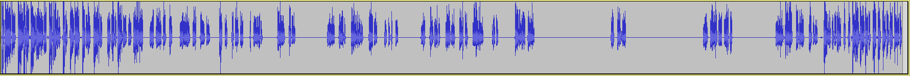
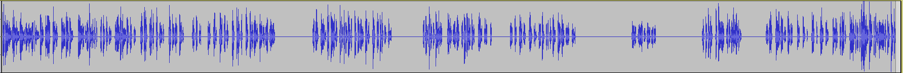
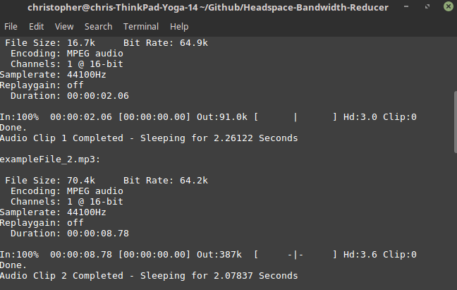
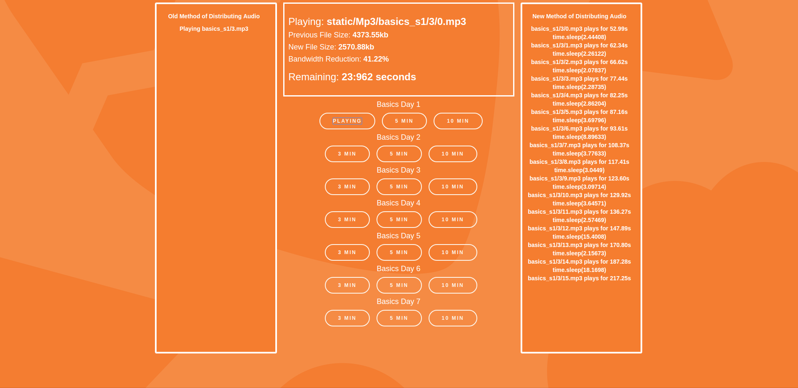

# Headspace-Bandwidth-Reducer
Proposal to the Headspace App to reduce server costs

### Proposal

The average size of the audio downloaded from the Headspace app is <b>10.16MB</b>.  Based on the fundamental purpose of a guided meditation app, a majority of these audio files contain long durations of complete silence.  Analyzing <b>1607</b> audio files, we can see that an average of <b>43.77%</b> of each HeadSpace Audio file is complete silence (Defined as -50 decibals).

By seperating the files at points of extended silence, we can reduce server-side bandwidth usage by more than 73%.  Based on the tools created in this project, we can programatically seperate audio files based on silence duration.

I have created a proof of concept application that successfully reduces audio related Bandwidth costs...


[](#)
<p align="center">File: <b>basics_s1/3.mp3</b> | Initial Length: <b>270.40s</b> | Trimmed Length: <b>128.95s</b> | Total Silence: <b>141.45s</b> or <b>52.31%</b></p>

[](#)
<p align="center">File: <b>basics_s1/5.mp3</b> | Initial Length: <b>390.37s</b> | Trimmed Length: <b>162.56s</b> | Total Silence: <b>227.81s</b> or <b>58.36%</b></p>

[](#)
<p align="center">File: <b>basics_s1/10.mp3</b> | Initial Length: <b>690.55s</b> | Trimmed Length: <b>281.58s</b> | Total Silence: <b>408.97s</b> or <b>59.22%</b></p>

## Implementation in Pseudo-Code

```
audioFiles = audio.split(<=50 Decibals)
// Splits Mp3 File at every point equal to or below 50 Decibals
silenceDuration = audio.split(>50 Decibals)
// Splits Mp3 File at every point above 50 Decibals
for i in range(audioFiles.length)
    // Iterates from 0 to the length of audioFiles
    play audioFiles[i]
    // Plays guided meditation session
    pause silenceDuration[i].length
    // Pauses audio on the client end
```
## Actual Implementation

The actual process of programming this can be broken up into 7 different parts.

1. Create a method of differentiating between sound and silence in an audio file

2. Create a method of dynamically generating timestamps indicating a duration of <i>extended</i> silence

3. Create a function to split Audio files at these specified locations

4. Ensure that no portions of the audio file that contain speech are removed

5. Split all Headspace guided meditation Mp3 files while preserving timestamps indicating durations of extended silence

6. Create a way of distributing both the audio files and "Pause" durations to the user

7. Implement a client-side way of triggering a "Pause" in the audio playing within the Headspace app


### #1 & #2

[FFMPEG](https://github.com/FFmpeg/FFmpeg) allows us to differentiate between audio and silence.  Also using FFMPEG's -d parameter, we can detect extended instances of silence within an audio file.

Below is the python script that redirects FFMPEG's output from stdout to the variable "tmp", and extracts all duration timestamps.  These timestamps are stored in a python dictionary, which is eventually saved as JSON.

```python
# This code is found in bandwidthModifer.py | Lines 79-91
def getSilenceTimestamps(audioFile, duration=2):
  splitPoints = []
  output, tmp = commands.getstatusoutput("ffmpeg -i {} -af silencedetect=noise=-50dB:d={} -f null -".format(audioFile, duration))
  #output, tmp = commands.getstatusoutput("sox -V3 {} newAudio.mp3 silence -l 1 0.0 -50d 1 1.0 -50d : newfile : restart".format(audioFile))
  for i, var in enumerate(str(tmp).split("\n")):
    if "_end" in str(var):
      try:
        end, duration = re.findall("\d+\.\d+", str(var))
        start = re.findall("\d+\.\d+", str(tmp.split("\n")[i-1]))[0]
        splitPoints.append({"Start": float(start), "End": float(end), "Duration": float(duration)})
      except Exception as exp:
        pass
  return splitPoints
```

### #3, #4, and #5

By splitting the audio files <i>after</i> generating the silence timestamps, we can ensure that there will be no overlap between silence intervals and audio intervals.  Additionally, verifications are put in place to prevent errors with FFMPEG's silence durations to ensure that no timestamps overlap in the audio structure.


```python
# This code is found in splitAt.py | Line 20-30
def genNew(jsonFile):
  directory = jsonFile[::-1].partition('/')[2][::-1]
  num = jsonFile.replace(directory, "").replace(".json", "")
  prevTime = 0.0
  os.system("rm -rf {}".format(jsonFile.replace(".json", "")))
  os.system("mkdir {}".format(jsonFile.replace(".json", "")))
  for i, val in enumerate(json.load(open(jsonFile))):
    if float(val["Start"]) < float(prevTime):
      break
    os.system("ffmpeg -i {}/{}.mp3 -c copy -ss {} -to {} {}/{}/{}.mp3".format(directory, num, prevTime, val["Start"], directory, num, i))
    prevTime = val['End']
```

### #6

Distributing the timestamps of periods of extended silence was done using a Flask-Based REST API.

Below you can find an example audio structure that is returned when a GET request is made to the API endpoint: /getStructure/{sessionName}/{sessionDuration}

```javascript
[{"Duration": 2.44408, "Start": 52.9888, "End": 55.4329},
{"Duration": 2.26122, "Start": 62.3407, "End": 64.6019},
{"Duration": 2.07837, "Start": 66.6247, "End": 68.7031},
{"Duration": 2.28735, "Start": 77.4394, "End": 79.7268},
{"Duration": 2.86204, "Start": 82.246, "End": 85.108},
{"Duration": 3.69796, "Start": 87.157, "End": 90.8549},
{"Duration": 8.89633, "Start": 93.6092, "End": 102.506},
{"Duration": 3.77633, "Start": 108.368, "End": 112.145},
{"Duration": 3.0449, "Start": 117.407, "End": 120.452},
{"Duration": 3.09714, "Start": 123.598, "End": 126.695},
{"Duration": 3.64571, "Start": 129.919, "End": 133.565},
{"Duration": 2.57469, "Start": 136.267, "End": 138.842},
{"Duration": 15.4008, "Start": 147.892, "End": 163.292},
{"Duration": 2.15673, "Start": 170.801, "End": 172.958},
{"Duration": 18.1698, "Start": 187.284, "End": 205.454},
{"Duration": 7.79918, "Start": 217.247, "End": 225.046}]
```

Interacting with this data is language dependant, but most languages make it relatively easy to work with JSON.  The "Duration" key references the duration of silence, "Start" references the point at which the silence began, and "End" references the point at which the silence stopped.

We can also calculate the length of the audio file using something like this:

```python
audioLength = jsonFile[indexNum]["Start"] - jsonFile[indexNum-1]["End"]
```

### #7

Unfortunately, I have no way of either viewing or modifying the way in which the Headspace app serves audio files.  However, I have implemented the modified method of distributing audio using both [Python](bandwidthModifier.py) and [Javascript](templates/index.html).  Additionally, the way in which silence durations are structured makes it relatively easy to implement #7 using Swift (IOS) or Kotlin (Android).

I began the process of solving issue #7 using a command line utility that can be found by running [bandwidthModifer.py](bandwidthModifier.py) directly.
<p align="center">
</p>
<p align="center"><b>Initial Command Line Interface</b></p>

<h3 align="center">CLI Background Code</h3>

```python
# This code is found in bandwidthModifier.py | Lines: 117-124
audioFile = 'sampleFile.mp3'
jsonInfo = splitAudio(audioFile)
with open('{}.json'.format(audioFile.partition(".")[0]), 'w') as fp:
  json.dump(jsonInfo, fp)
for i, val in enumerate(jsonInfo):
  os.system("play {}_{}.mp3".format(audioFile.replace(".mp3", ""), i))
  print("Audio Clip {} Completed - Sleeping for {} Seconds".format(i, val["Duration"]))
  time.sleep(val["Duration"])
```
From a visual standpoint, the CLI was a very ineffective way of displaying the change that was made by switching to an alternate way of structuring the audio files.  I created a web app using Flask that better visualized the bandwidth difference between the files.

[](#)
<p align="center"><b>Web App</b></p>
<h3 align="center">Web App "Background" Code</h3>

```javascript
function streamAudio(sessionType, time){
  // This is the function that plays the audio
  stopAllAudio();
  // This will stop all playing audio
  var url = "/getStructure/" + sessionType + "/" + time;
  // This will return file structure
  jsonString = httpGet(url);
  // This is the actual file structure
  obVal = JSON.parse(jsonString);
  // Converting string to json so we can interact with it
  window.audioLengthDB = obVal.newInfo;
  // Basically sets the value as global
  var obj = obVal.prevInfo;
  // Old Value is the structure of the file
  var fileName = "static/Mp3/" + sessionType + "/" + time + "/0" + ".mp3";
  // This is the filename for the actual mp3File
  var audio = new Audio(fileName);
  // Creates new audio object - not in the loop because the first val in
  // structure response is 1.mp3 instead of 0.mp3
  audios.push(audio);
  // Adds this audio object to the array of audio objects
  // This is there so we can "Stop" all of them when another button is clicked
  fileSizeURL = "/getAllSize/" + sessionType + "/" + time;
  // This is the structure of the api call
  jsonString = httpGet(fileSizeURL);
  // This makes a json request to the flask API to get file size info
  var fileInfo = JSON.parse(jsonString);
  // This contains the information about the file size
  var prevEnd = 0;
  // This sets it to 0 before the loop
  setToPlay(audio, 0, fileName, sessionType, time, 0, fileInfo);
  // This tells the progrma to start playing this audio file in 0 seconds
  // Setting time as 0 will make it play immediately
  oldOutput("<b>Playing " + sessionType + "/" + time + ".mp3" + "</b><br>");
  // Adds the file info to the "OldOutput" div
  // Since this web app is only using the new output method of distributing
  // audio, this is just text saying what the old method *would* have been.
  newOutput("<b>" + sessionType + "/" + time + "/0.mp3 plays for " + (obj[0].End - obj[0].Duration).toFixed(2) + "s" + "</b><br>");
      // This ADDS the new file output to the div
  for (fileIndex in obj) {
    // The json object is a list, so this is the INDEX of all items in the list
    listElem = obj[fileIndex];
    // This assigns listElem as the actual object rather than the index number
    var tempNum = parseInt(fileIndex) + 1;
    // This tells it to start at 1.mp3 instead of 0.mp3
    if (tempNum < obj.length) {
      // This makes it iterate through all mp3 files
      var fileName = "static/Mp3/" + sessionType + "/" + time + "/" + tempNum + ".mp3";
      // Assigns filename of the mp3 file being played
      var audio = new Audio(fileName);
      // Creates new audio object
      audios.push(audio);
      // Adds this audio object to the array of audio objects
      // This is there so we can "Stop" all of them when another button is clicked
      newOutput("<b>time.sleep(" + listElem.Duration + ")" + "</b><br>");
      // This ADDS the sleep output after this file to the div
      newOutput("<b>" + sessionType + "/" + time + "/" + tempNum + ".mp3 plays for " + (obj[tempNum].End - obj[tempNum].Duration).toFixed(2) + "s" + "</b><br>");
      // This ADDS the new file output to the div
      setToPlay(audio, listElem.End*1000, fileName, sessionType, time, tempNum, fileInfo);
      // This sets an event to play the audio file at obj['end'] - prevElem
      }
    }
  }
```
<p align="center"><b>Please don't judge this code too harshly.  My skillset does <i>not</i> include Javascript, and this is pretty much the first project that I've done that's used Javascript this heavily...</b></p>

## Example: basics_S1/3.Mp3


<p align="center"><b>Original File Served by Headspace | 4373.55 kB</b></p>


```javascript
[{"Duration": 2.44408, "Start": 52.9888, "End": 55.4329},
{"Duration": 2.26122, "Start": 62.3407, "End": 64.6019},
{"Duration": 2.07837, "Start": 66.6247, "End": 68.7031},
{"Duration": 2.28735, "Start": 77.4394, "End": 79.7268},
{"Duration": 2.86204, "Start": 82.246, "End": 85.108},
{"Duration": 3.69796, "Start": 87.157, "End": 90.8549},
{"Duration": 8.89633, "Start": 93.6092, "End": 102.506},
{"Duration": 3.77633, "Start": 108.368, "End": 112.145},
{"Duration": 3.0449, "Start": 117.407, "End": 120.452},
{"Duration": 3.09714, "Start": 123.598, "End": 126.695},
{"Duration": 3.64571, "Start": 129.919, "End": 133.565},
{"Duration": 2.57469, "Start": 136.267, "End": 138.842},
{"Duration": 15.4008, "Start": 147.892, "End": 163.292},
{"Duration": 2.15673, "Start": 170.801, "End": 172.958},
{"Duration": 18.1698, "Start": 187.284, "End": 205.454},
{"Duration": 7.79918, "Start": 217.247, "End": 225.046}]
```
<p align="center"><b>JSON Returned from /getStructure/basics_s1/3</b></p>


<p align="center">

</p>
<p align="center"><b>New File Structure | 2570.88 kB</b></p>

<h1 align="center">Bandwidth Reduction: 41.22%</h1>


## Actual Implementation

So from a processing standpoint it would be illogical to split audio files on <i>every</i> request made to the server, however it would not be computationally intensive to go through each current headspace Mp3 file and split at points below -50 Decibals.

Finding timestamp information from an Mp3 file is relatively easy using FFMPEG.  Here is

```python
def getSilenceTimestamps(audioFile, duration=2):
  splitPoints = []
  output, tmp = commands.getstatusoutput("ffmpeg -i {} -af silencedetect=noise=-50dB:d={} -f null -".format(audioFile, duration))
  #output, tmp = commands.getstatusoutput("sox -V3 {} newAudio.mp3 silence -l 1 0.0 -50d 1 1.0 -50d : newfile : restart".format(audioFile))
  for i, var in enumerate(str(tmp).split("\n")):
    if "_end" in str(var):
      try:
        end, duration = re.findall("\d+\.\d+", str(var))
        start = re.findall("\d+\.\d+", str(tmp.split("\n")[i-1]))[0]
        splitPoints.append({"Start": float(start), "End": float(end), "Duration": float(duration)})
      except Exception as exp:
        pass
  return splitPoints
```

